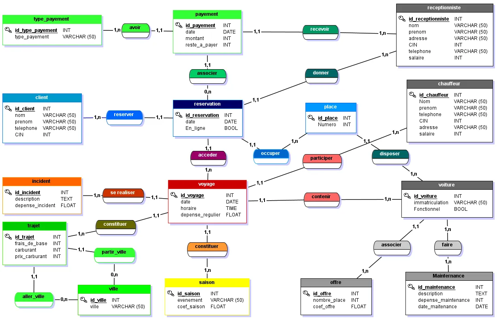

# Data2_Soavadia

<div id="top"></div>

<br />
<div align="center">

  <h3 align="center">SOAVADIA</h3>


</div>

 

 <!-- TABLE OF CONTENTS -->
<details>
  <summary>Table of Contents</summary>
  <ul>
    <li>
        <a href="#Description">Description</a>
    </li>
    <li>
      <a href="#Usage">Usage</a>
    </li>
    <li>
        <a href="#Merise">JMerise</a>
    </li>
    <li>
      <a href="#Contributors">Contributors</a>
    </li>
  </ul>
</details>

## Description

SOAVADIA is a transport company project desing by HEI's students(Haute Ecole d'Informatique). 

This database contains the structure of the future company and its data. 

## Usage

* Clone this repo with 
```sh
 git init
```
```sh
 git clone https://github.com/ManoaRRR/BDD_Soavadia
```
You can execute psql commands from `psql file` with 
`\i (your file path)`

And `\c` to connect to the DataBase.

## Merise

 

## Contributors

[](https://github.com/LovaSalema)

[](https://github.com/ManoaRRR)

[](https://github.com/Tiantsoa79)
